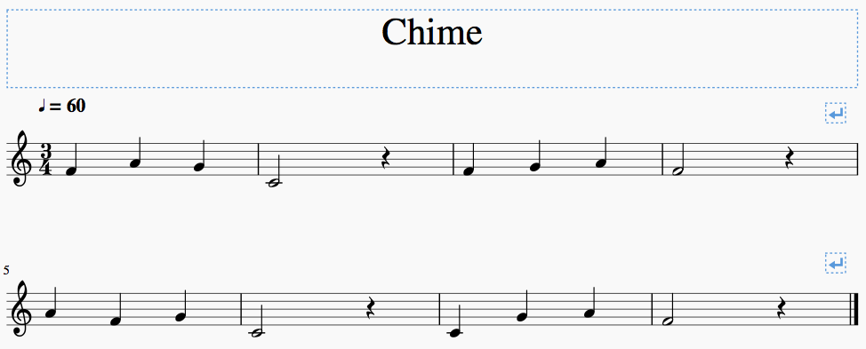

# Arduino用　Music.h

## 簡単な使い方

1. 「Clone or download」→「Download ZIP」でダウンロード
2. ダウンロードしたzipファイルを解凍する
3. 「Music.cpp」と「Music.h」をinoファイル(Arduinoのソースコード)と同じ場所に置く
4. inoファイルの先頭に`#include "Music.h"`と書く
5. 音楽を流したいタイミングで`playMusic(ピン番号, 音楽名, BPM);`を使う。
6. 音楽の作り方は下記参照


## 詳しい使い方

### 関数 playMusic(int PIN, note notes[], int bpm)
- 音楽の再生には、この関数を使用してください
- 第一引数はブザーのピン番号
- 第二引数は音楽の配列
- 第三引数は音楽のBPM(速さ)

### サンプル音楽
- サンプル音楽を用意しています
- `playMusic(ピン番号, 音楽名, BPM);`のように指定してください

音楽名|参考BPM|説明
--|--|--
kirbyClear|150|「星のカービィ」より、ゲームクリア
kirbyDead|150|「星のカービィ」より、ミス
marioStart|100|「スーパーマリオブラザーズ」より、ゲームスタート
marioDead|100|「スーパーマリオブラザーズ」より、ミス
safariPark|128|富士サファリパークCMソング
pythagora|125|ピタゴラスイッチのテーマ

### 音楽の作り方
- 音楽はnote構造体の配列を用いて作ります
- 他の変数や定数と同じ場所で宣言します
- note構造体は`{pitch, duration}`で指定
	- `pitch`…音の高さ
		- 直接周波数を指定するか、`NOTE_A1`のように指定
		- `NOTE_B0`〜`NOTE_DS8`まで指定可能
		- 直接指定する場合は整数値を使用してください。
		- 休符は`NOTE_NON`を使ってください
		- __曲の最後は必ず`NOTE_END`を指定してください__
	- `duration`…音の長さ
		- x分音符のxを入れてください
		- 付点音符は1.5で割り算してください（ex.付点４分音符 → 4 / 1.5）
		- こちらは小数も指定可能です。


### 音楽の作り方の例
- 学校のチャイムの例


```C
// はじめは「note 曲名[] = {」で書き始める
note chime[] = {
	{NOTE_F5, 4},	// F5 = ファ、4分音符
	{NOTE_A5, 4},	// A5 = ラ、4分音符
	{NOTE_G5, 4},	// G5 = ソ、4分音符
	
	{NOTE_C5, 2},	// C5 = ド、2分音符
	{NOTE_NON, 4},	// 休符、4分音符
	
	{NOTE_F5, 4},
	{NOTE_G5, 4},
	{NOTE_A5, 4},
	
	{NOTE_F5, 2},
	{NOTE_NON, 4},

	{NOTE_A5, 4},
	{NOTE_F5, 4},
	{NOTE_G5, 4},
	
	{NOTE_C5, 2},
	{NOTE_NON, 4},
	
	{NOTE_C5, 4},
	{NOTE_G5, 4},
	{NOTE_A5, 4},
	
	{NOTE_F5, 2},
	{NOTE_NON, 4},
	
	{NOTE_END, -1}	// 曲の終わりはNOTE_END(長さは何でも良い)
};
// 「};」で終わる
```


## Arduino IDEへのインストール方法(発展)
1. 「Clone or download」→「Download ZIP」でダウンロード
2. ダウンロードしたzipファイルを「Music」にリネーム
2. Arduino IDEを開く
3. メニューバーから「スケッチ」→「ライブラリをインクルード」→「.ZIP形式のライブラリをインストール」を選択
4. 1.でダウンロードしたMusicフォルダを選択
5. スケッチファイルの先頭に`#include <Music.h>`が追加されればOK

## インストール済みライブラリのインクルード方法(発展)
1. Arduino IDEを開く
2. メニューバーから「スケッチ」→「ライブラリをインクルード」→「Music」を選択
3. スケッチファイルの先頭に`#include <Music.h>`が追加されればOK
